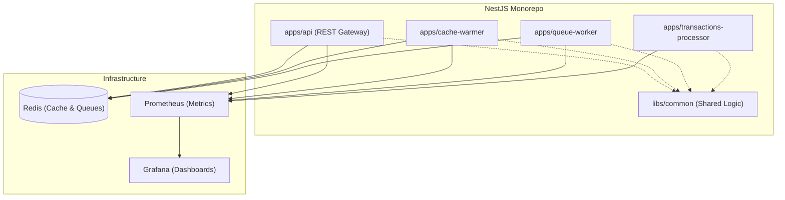

# MultiversX Assets CDN - API

Unified REST API facade and background synchronization service for serving, proxying, and caching blockchain token, identity, and account metadata in the MultiversX ecosystem.

---

## 🚀 Quick start

1.  **Install Dependencies:**
    ```bash
    npm install
    ```
2.  **Environment Setup:**
    Copy the example environment file and configure your credentials:
    ```bash
    cp .env.example .env
    # Edit .env and configure your variables
    ```
3.  **Start Services:**
    Start the required infrastructure (Redis, Prometheus, Grafana):
    ```bash
    docker compose up -d
    ```

After running the services, you can shut down the containers using:

```bash
docker compose down
```

---

## 📦 Dependencies

1.  **Redis Server:** Required for high-performance distributed caching, rate-limiting, and queue management (via Bull).
2.  **Prometheus & Grafana:** Included for built-in observability, metrics collection, and monitoring dashboards.

---

## 🏃 Running the Apps

This is a NestJS monorepo containing multiple operational microservices. You can start any of them using the predefined npm scripts.

### 1. API Gateway (`apps/api`)

Provides high-performance public REST endpoints and serves the core application API.

- **Start Command:**
  ```bash
  npm run start:api
  ```
- _Default Port:_ [http://localhost:3000/assets-cdn](http://localhost:3000/assets-cdn) (Private Port: 4000)

### 2. Cache Warmer (`apps/cache-warmer`)

Runs periodic background jobs to keep the Redis cache populated with fresh data.

- **Start Command:**
  ```bash
  npm run start:cache-warmer
  ```
- _Default Port:_ 4001

### 3. Queue Worker (`apps/queue-worker`)

Handles asynchronous task processing using Bull queues.

- **Start Command:**
  ```bash
  npm run start:queue-worker
  ```
- _Default Port:_ 4002

### 4. Transactions Processor (`apps/transactions-processor`)

Dedicated microservice for indexing and processing blockchain transactions.

- **Start Command:**
  ```bash
  npm run start:transactions-processor
  ```
- _Default Port:_ 4003

---

## 🧪 Testing

We ensure service reliability and performance via comprehensive test suites:

### Unit Tests

Executes Jest unit tests across all applications and shared libraries:

```bash
npm run test
# Watch mode
npm run test:watch
# Coverage report
npm run test:cov
```

### End-to-End (E2E) Tests

Runs integration tests against the API gateway:

```bash
npm run test:e2e
```

### Load Tests (k6)

> [!NOTE]
> Ensure the API Gateway service is actively running before starting the load tests.

Performs automated performance and load testing against the HTTP endpoints:

```bash
npm run test:performance
```

---

## 🏗️ Architecture & Microservice Modes

This project is structured as a robust NestJS Monorepo to separate public web-serving concerns from periodic background workloads and intensive transaction processing.



### Shared Libraries (`libs/common`)

Contains reusable entities, DTOs, configuration schemas, and decorators shared across all microservices to enforce consistency.

---

## 📊 Observability & Monitoring

The monorepo comes pre-configured with a full observability stack using Prometheus and Grafana.

- **Prometheus:** Scrapes metrics from the private ports of all microservices.
  - _Dashboard:_ [http://localhost:9090](http://localhost:9090)
- **Grafana:** Provides rich visualizations and dashboards for the collected metrics.

  You can find a predefined Grafana dashboard with basic metrics at [http://localhost:3010](http://localhost:3010)

  Use `admin` for user and password fields. Then navigate to `Dashboards` -> `Template Service`

To view the monitoring data, ensure you have started the infrastructure containers via `docker compose up -d`.

---

## 🔧 Configuration Reference

Behavior is managed using environment variables loaded from the `.env` file and structured config via `config/config.yaml` & `config/schema.yaml`.

| Variable                  | Description                                                | Default               |
| :------------------------ | :--------------------------------------------------------- | :-------------------- |
| `PORT`                    | Listening port for the API REST Gateway service            | `3000`                |
| `ALLOWED_ORIGIN`          | Allowed domains for CORS (comma-separated, `*` allows all) | `*`                   |
| `ALLOWED_HOSTS`           | Allowed host headers for security enforcement              | `localhost,127.0.0.1` |
| `REDIS_HOST`              | Redis connection host                                      | `127.0.0.1`           |
| `REDIS_PORT`              | Redis connection port                                      | `6379`                |
| `REDIS_PASSWORD`          | Optional Redis password                                    | `""`                  |
| `PRIVATE_API_ALLOWED_IPS` | IP restrictions for private ports (metrics/health)         | `""`                  |

---

## 🛡️ Code Quality & Security

- **Linting & Formatting:** Enforced via ESLint and Prettier (`npm run lint`, `npm run format`).
- **Security Auditing:** Integrated `npm audit` check for production dependencies (`npm run audit:security`).
